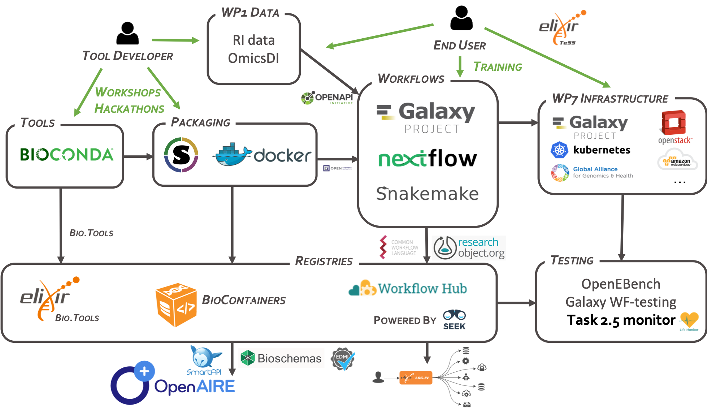

# Tools Collaboratory Roadmap

Information on the tools, platforms and standards the Tools Collaboratory will support in the EOSC-life project.

## WP2 Tasks

1. Make tools and workflows interoperable and reusable in the EOSC across RIs (Frederik Coppens, Björn Grüning)

2. Tool findability and registries (Carole Goble)

3. Address demonstrators from WP3 ()

4. The Tools Collaboratory (Jean-Karim Heriche)

5. Sustainability (Gianluigi Zanetti/Luca Pireddu)

## Initial roadmap as presented at the kickoff meeting

## Communication channels

* [EOSC-Life website](https://www.eosc-life.eu)
* General questions can be asked [EOSC-Life Forum](https://forum.eosc-life.eu)
* Code related: GitHub issues in repositories in the [EOSC-Life GitHub organisation](https://github.com/eosc-life)
